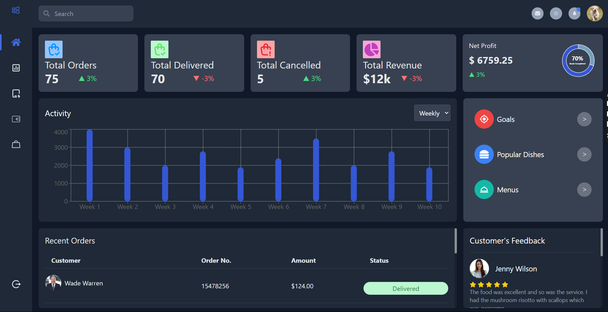

# Dashboard

This dashboard offers a clear view of important business metrics like total orders, deliveries, cancellations, revenue, and net profits. Built with React.js and styled using Tailwind CSS, it works smoothly on all devices. With react-recharts, the dashboard includes interactive charts to visualize activities. It also has sections for user feedback and recent orders, providing a complete picture of your business at a glance.

# Snippets

# Tech-Stacks

ReactJS, Tailwind CSS, React-Recharts, react-icons, Framer-motion

# Instructions

To start, clone the repository by executing the command: "git clone [https://github.com/ay690/Fitpeo_Assignment.git]". After cloning, navigate into the repository directory and install dependencies using the command "npm install". Once the installation is complete, run the code with "npm run dev". Ensure to execute these commands in your terminal.
